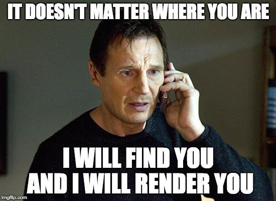

# Resources

Read or watch:

- [React Official Website](https://react.dev/)
- [Getting started with React](https://www.taniarascia.com/getting-started-with-react/)
- [Quick Start with React](https://react.dev/learn)
- [create-react-app](https://github.com/facebook/create-react-app)
- [React Developer Tools](https://chromewebstore.google.com/detail/react-developer-tools/fmkadmapgofadopljbjfkapdkoienihi?pli=1)
- [What is Babel?](https://babeljs.io/docs/)
- [Enzyme](https://enzymejs.github.io/enzyme/docs/api/shallow.html)