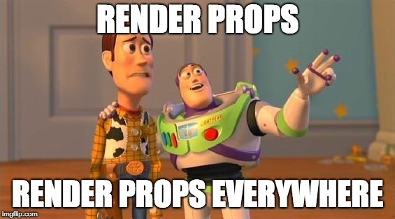

# Resources
## Read or watch:

- [React Official Website](https://react.dev/)
- [Getting started with React](https://www.taniarascia.com/getting-started-with-react/)
- [React Developer Tools](https://chromewebstore.google.com/detail/react-developer-tools/fmkadmapgofadopljbjfkapdkoienihi)
- [Enzyme](https://enzymejs.github.io/enzyme/docs/api/shallow.html)
- [React Fragments](https://react.dev/reference/react/Fragment)