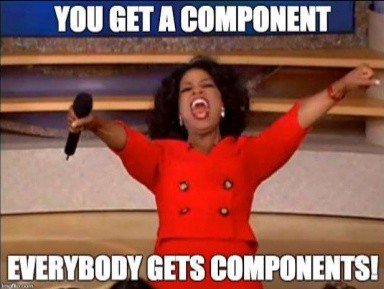

## Resources

Read or watch:

- [React components](https://legacy.reactjs.org/docs/react-component.html)
- [React Developer Tools](https://chromewebstore.google.com/detail/react-developer-tools/fmkadmapgofadopljbjfkapdkoienihi)
- [Enzyme Shallow](https://enzymejs.github.io/enzyme/docs/api/shallow.html)
- [Enzyme Mount](https://enzymejs.github.io/enzyme/docs/api/ReactWrapper/mount.html)
- [Enzyme Unmount](https://enzymejs.github.io/enzyme/docs/api/ReactWrapper/unmount.html)
- [React Pure components](https://legacy.reactjs.org/docs/react-api.html)
- [React Higher Order Components](https://legacy.reactjs.org/docs/higher-order-components.html)
- [Jest mock function](https://jestjs.io/docs/jest-object)