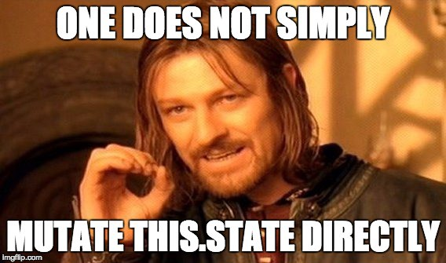

# 0x05. React state

# Resources:

- [State and lifecycle](https://legacy.reactjs.org/docs/state-and-lifecycle.html)
- [SetState and State callback](https://legacy.reactjs.org/docs/react-component.html)
- [Context](https://legacy.reactjs.org/docs/context.html)
- [Forms and Controlled components](https://legacy.reactjs.org/docs/forms.html)
- [Lifting State Up](https://legacy.reactjs.org/docs/lifting-state-up.html)
- [React Hooks](https://legacy.reactjs.org/docs/hooks-intro.html)
- [Enzyme State](https://enzymejs.github.io/enzyme/docs/api/ReactWrapper/state.html)
- [Enzyme SetState](https://enzymejs.github.io/enzyme/docs/api/ShallowWrapper/setState.html)
- [Enzyme Instance](https://enzymejs.github.io/enzyme/docs/api/ShallowWrapper/instance.html)
- [Enzyme Simulate](https://enzymejs.github.io/enzyme/docs/api/ShallowWrapper/simulate.html)