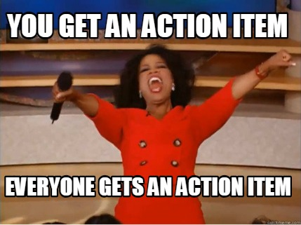

# Resources

* [Normalizr](https://github.com/paularmstrong/normalizr)
* [Normalizing State Shape](https://redux.js.org/usage/structuring-reducers/normalizing-state-shape)
* [Redux Getting started and core concepts](https://redux.js.org/introduction/getting-started)
* [Redux Actions](https://redux.js.org/tutorials/fundamentals/part-2-concepts-data-flow)
* [Async Actions](https://redux.js.org/tutorials/fundamentals/part-6-async-logic)
* [Writing tests for Redux](https://redux.js.org/usage/writing-tests)